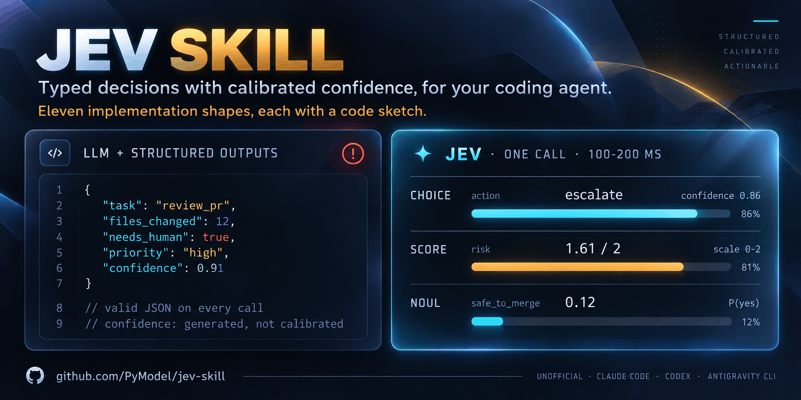
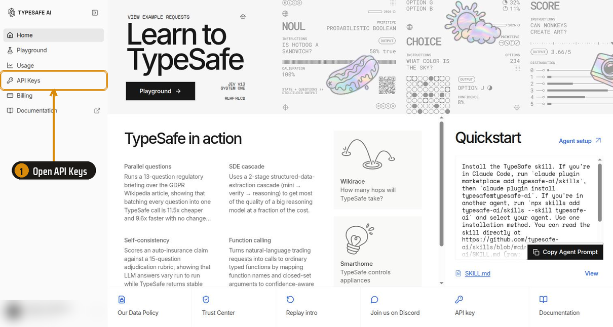
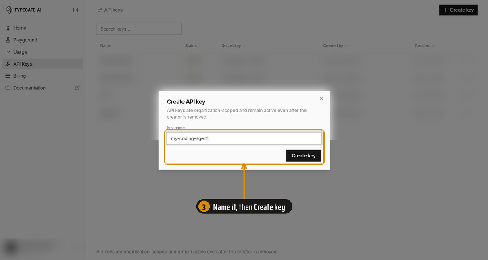

<p align="center">
  
</p>

<p align="center">
  <a href="LICENSE"></a>
  <a href=".github/workflows/checks.yml"></a>
  
  <a href="https://github.com/PyModel/jev-skill/stargazers"></a>
  
  <a href="https://docs.typesafe.ai"></a>
  <a href="https://x.com/moelkholy95"></a>
</p>

> [!NOTE]
> This is an unofficial, community skill. It is not made, reviewed, or endorsed by TypeSafe AI. TypeSafe publishes its own skill at [typesafe-ai/skills](https://github.com/typesafe-ai/skills). See [How this differs from the official skill](#how-this-differs-from-the-official-skill).

Coding agents treat Jev like one more chat model. This skill teaches them to design for it: typed questions, calibrated confidence, and eleven implementation shapes, each with a code sketch and the field lessons behind it. It installs in Claude Code, Codex, Antigravity CLI, Muse, and Muse Code.

[Jev](https://docs.typesafe.ai/introduction) is a [System One](https://docs.typesafe.ai/concepts/system-one) model. It does not write text. You send it content and a set of typed questions, and it answers each one with a value and a calibrated probability, usually in 100 to 200 ms:

| Primitive | Answers | Example |
|---|---|---|
| **Choice** | one option from a list you give | route a ticket to billing, shipping, or support |
| **Score** | a position on a scale you describe | grade a pull request from "ignores the spec" to "meets the spec" |
| **Noul** | the probability that a yes/no statement is true | "this shell command deletes files outside the project" |

## Quick example

```python
from typesafe_sdk import TypeSafeClient, Choice, Noul, Score

with TypeSafeClient() as client:
    r = client.system_one(
        state={"task": "review_pr", "files_changed": 12,
               "needs_human": True, "priority": "high"},
        questions={
            "action": Choice(instructions="What should happen to this pull request?",
                             criteria={"approve": None, "comment": None, "escalate": None}),
            "risk": Score(instructions="How risky is merging it?",
                          criteria=["Safe to merge", "Needs a careful read",
                                    "Needs a maintainer"]),
            "safe_to_merge": Noul(
                instructions="Is this pull request safe to merge without a human?"),
        },
    )

r.choices["action"].choice      # "escalate"
r.choices["action"].confidence  # 0.86    how peaked the probabilities are
r.scores["risk"].score          # 1.61    of 2, and it can fall between levels
r.nouls["safe_to_merge"].noul   # 0.12    the probability the statement is true
```

Exact request and response shapes, SDK signatures, limits, and errors: [`skills/jev/api-reference.md`](skills/jev/api-reference.md).

## Contents

- [Install](#install)
- [Set up an API key](#set-up-an-api-key-optional-recommended)
- [How it was tested](#how-it-was-tested)
- [What is inside](#what-is-inside)
- [The shape library](#the-shape-library)
- [How this differs from the official skill](#how-this-differs-from-the-official-skill)
- [Credits](#credits)
- [License](#license)

## Install

Pick your agent. Every command installs from `PyModel/jev-skill`.

<details>
<summary><strong>Claude Code</strong></summary>

```bash
claude plugin marketplace add PyModel/jev-skill
```

```bash
claude plugin install jev@jev
```

The skill loads on its own when you work on Jev code. To load it by hand, type:

```
/jev:jev
```

</details>

<details>
<summary><strong>Codex</strong></summary>

```bash
codex plugin marketplace add PyModel/jev-skill
```

```bash
codex plugin add jev@jev
```

Start a new thread. Codex loads the skill when the task matches. To load it by hand, type:

```
$jev:jev
```

</details>

<details>
<summary><strong>Antigravity CLI</strong></summary>

```bash
agy plugin install https://github.com/PyModel/jev-skill
```

Check that it installed:

```bash
agy plugin list
```

Start a new session. Antigravity CLI loads the skill when the task matches. To load it by hand, type:

```
/jev:jev
```

Coming from Gemini CLI? If `agy plugin import gemini` brought this extension over, run the install command above anyway so the current copy replaces the imported one.

</details>

<details>
<summary><strong>Muse (muse.ai)</strong></summary>

Muse loads skills from `~/workspace/skills/` on its own computer. Paste this command into a Muse chat and ask Muse to run it:

```bash
curl -fsSL https://raw.githubusercontent.com/PyModel/jev-skill/main/scripts/install_muse.sh | bash
```

The script copies the skill folder there and rewrites the `SKILL.md` header into the shape Muse reads. Start a new chat. Muse loads the skill when the task matches. To update, run the command again.

</details>

<details>
<summary><strong>Muse Code</strong></summary>

Clone the repository:

```bash
git clone https://github.com/PyModel/jev-skill.git
```

Install the skill for every project:

```bash
muse skills install jev-skill/skills/jev --scope user
```

Check that it installed:

```bash
muse skills list
```

Start a new session. Muse Code loads the skill when the task matches. To load it by hand, type:

```
/jev
```

</details>

<details>
<summary><strong>Any other agent that reads SKILL.md</strong></summary>

Copy the `skills/jev/` folder into your agent's skills folder. Keep the whole folder. `SKILL.md` links to the files beside it.

</details>

## Set up an API key (optional, recommended)

The skill works without a key. With `TYPESAFE_API_KEY` set in the agent's shell, the agent can check its design against the live API before the code reaches your project. That catches wrong field names, and questions Jev reads differently than you meant. Each call costs a fraction of a cent.

<details>
<summary><strong>Create a key</strong> (four steps in the TypeSafe console)</summary>

<br>

**Step 1.** Sign in at [console.typesafe.ai](https://console.typesafe.ai/) and open **API Keys** in the sidebar.



**Step 2.** Click **Create key** at the top right.


**Step 3.** Name the key after where it will live, such as the machine or the agent. Then click **Create key**.



**Step 4.** Copy the key now. The console shows it once. If you lose it, create a new one and revoke the old one.


</details>

<details>
<summary><strong>Store the key</strong> (macOS, Linux, Windows)</summary>

<br>

Keep the key in its own file, readable only by you, and export it as `TYPESAFE_API_KEY`. Agents often start shells without a terminal, so each section puts the key where those shells can see it. Pick your system.

<details>
<summary><strong>macOS</strong> (zsh, the default shell)</summary>

Save the key to a private file:

```bash
mkdir -p ~/.config/typesafe && umask 077 && printf 'export TYPESAFE_API_KEY=%s\n' 'YOUR_KEY' > ~/.config/typesafe/env
```

Load it from `~/.zshenv`. Every zsh reads that file, including shells that agents start without a terminal. `~/.zshrc` is read only by interactive shells.

```bash
echo '[ -f ~/.config/typesafe/env ] && . ~/.config/typesafe/env' >> ~/.zshenv
```

Open a new terminal and check it. The command prints the length of the key, not the key:

```bash
echo ${#TYPESAFE_API_KEY}
```

</details>

<details>
<summary><strong>Linux with bash</strong> (Ubuntu, Debian, Mint, Fedora, Arch)</summary>

Save the key to a private file:

```bash
mkdir -p ~/.config/typesafe && umask 077 && printf 'export TYPESAFE_API_KEY=%s\n' 'YOUR_KEY' > ~/.config/typesafe/env
```

Load it from the **top** of `~/.bashrc`. Ubuntu, Debian, Mint, and Arch start `~/.bashrc` with a line that stops early when no terminal is attached. A line below that guard never runs for agent shells. The top of the file is safe on every distribution:

```bash
sed -i '1i [ -f ~/.config/typesafe/env ] \&\& . ~/.config/typesafe/env' ~/.bashrc
```

Open a new terminal and check it:

```bash
echo ${#TYPESAFE_API_KEY}
```

</details>

<details>
<summary><strong>Linux with zsh</strong></summary>

Follow the macOS steps. zsh reads `~/.zshenv` the same way on Linux.

</details>

<details>
<summary><strong>Linux with fish</strong></summary>

fish reads every file in `~/.config/fish/conf.d/`, with or without a terminal:

```fish
mkdir -p ~/.config/fish/conf.d; and echo 'set -gx TYPESAFE_API_KEY YOUR_KEY' > ~/.config/fish/conf.d/typesafe.fish; and chmod 600 ~/.config/fish/conf.d/typesafe.fish
```

```fish
string length -- $TYPESAFE_API_KEY
```

</details>

<details>
<summary><strong>Windows</strong> (PowerShell)</summary>

Store the key as a user environment variable. New terminals and apps see it. Terminals that are already open do not:

```powershell
[Environment]::SetEnvironmentVariable('TYPESAFE_API_KEY', 'YOUR_KEY', 'User')
```

Open a new terminal and check it:

```powershell
$env:TYPESAFE_API_KEY.Length
```

**WSL:** Windows variables do not reach WSL by default. Inside WSL, follow the Linux with bash steps.

</details>

<details>
<summary><strong>Desktop apps and IDE extensions</strong></summary>

An app you start from the dock, the start menu, or a desktop launcher does not read your shell files.

- **Windows:** the user environment variable above already covers these apps.
- **Linux (systemd):** add the line `TYPESAFE_API_KEY=YOUR_KEY` to `~/.config/environment.d/typesafe.conf`, then log out and back in.
- **macOS:** start the app from a terminal, or set the variable in the app's own settings. macOS has no simple per-user file that desktop apps read.

</details>

</details>

<details>
<summary><strong>If the agent cannot see the key</strong></summary>

<br>

Ask the agent to run `echo ${#TYPESAFE_API_KEY}` (or `$env:TYPESAFE_API_KEY.Length` on Windows). If it prints `0` or nothing, check these in order:

- **You started the agent before you stored the key.** Agent shells copy the environment of the program that started them. Quit the agent and start it from a new terminal.
- **You started the agent from the dock, the start menu, or an IDE.** Those apps do not read your shell files. See "Desktop apps and IDE extensions" above.
- **Codex filters the environment.** If `~/.codex/config.toml` sets `include_only` under `[shell_environment_policy]`, add `TYPESAFE_API_KEY` to it. If it sets `ignore_default_excludes = false`, Codex drops every variable with `KEY` in its name. Remove that line.
- **WSL.** Windows variables do not reach WSL. Store the key inside WSL with the Linux steps.

</details>

## How it was tested

We gave a coding agent six Jev tasks, such as a support-ticket triage function and an approval gate for shell commands. Each task ran 10 times with this skill, with no skill, and with the official skill, each arm in its own isolated container. The agent had the docs but no API key, so graders checked the code it wrote. Checks that need judgment went to three LLM judges from three providers (Claude Opus, GPT-6 Sol, Kimi K3), and the majority decided.

| | No skill | This skill | Official skill |
|---|---:|---:|---:|
| Average score | 0.65 ± 0.05 | **0.96 ± 0.02** | 0.77 ± 0.04 |

Score is the share of checks passed, averaged over 10 runs per task.

**Where the skill made the difference** (runs out of 10 that passed):

| The agent's code... | No skill | This skill | Official skill |
|---|---:|---:|---:|
| counted in code, instead of asking Jev for a number | 1 | 8 | 0 |
| named a field of the input in its questions | 0 | 10 | 1 |
| pinned or logged the Jev model version | 0 | 10 | 0 |
| gave the department list a catch-all option | 3 | 10 | 6 |
| kept more than one path while walking 1,200 categories | 1 | 10 | 7 |
| kept a plain-code backstop for destructive commands | 7 | 10 | 2 |
| read `score` as a position from 0 to n-1 | 9 | 10 | 5 |

[See every check →](evals/docs/results.md#every-check)

Each of these rows beats no skill, the official skill, or both by more than chance at 95%.

**More detail:**

- [evals/README.md](evals/README.md): results by case, and how to run the suite
- [evals/docs/results.md](evals/docs/results.md): every check, each judge's scores, cost, tokens, and method
- [evals/docs/cases.md](evals/docs/cases.md): the six tasks and what each check looks for
- [evals/docs/harness.md](evals/docs/harness.md): how a run works, the isolated containers, and how to keep a batch
- [evals/docs/lessons.md](evals/docs/lessons.md): what broke while the suite was being built

## What is inside

The skill loads in layers, so the agent reads only what the task needs.

| File | What it holds | When the agent reads it |
|---|---|---|
| `SKILL.md` | Which primitive to pick, 11 design rules, how to use probabilities and confidence, common mistakes | Every Jev task |
| `api-reference.md` | HTTP API, Python and JavaScript SDKs, limits, errors, environment variables | When it writes the code |
| `patterns.md` | The 4 official patterns and techniques from 18 cookbooks, with their thresholds | When it designs a workflow |
| `prior-art/INDEX.md` | A map from "what I want to build" to a shape, plus ideas that failed | Before it designs something new |
| `prior-art/*.md` | 11 shape files: a code sketch and the field lessons behind it | One or two per design |

## The shape library

Most catalogs sort projects by industry. This library sorts them by implementation shape. A game bot, a drone, and a trading bot share one shape: a control loop. Sorted that way, the three share one code sketch and one set of field lessons. The 11 shapes:

- **[Control loops](skills/jev/prior-art/control-loops.md)**: games, drones, robots, markets.
- **[Select from candidates](skills/jev/prior-art/select-from-candidates.md)**: browser and phone agents, tool calling without an LLM, extraction, routers.
- **[Gates](skills/jev/prior-art/gates.md)**: tool-call approval, "done" checks, CI, money, content.
- **[Stream filters](skills/jev/prior-art/stream-filters.md)**: slop filters, moderation, email, logs, bulk labels.
- **[Ranking and matching](skills/jev/prior-art/ranking-and-matching.md)**: rerankers, entity matching, graph and taxonomy walks.
- **[Judges and evals](skills/jev/prior-art/judges-and-evals.md)**: rubric judges, trace grading, code review as triage.
- **[Incremental and real-time](skills/jev/prior-art/incremental-realtime.md)**: dubbing, voice, keystroke-driven interfaces.
- **[Agent context and memory](skills/jev/prior-art/agent-context-memory.md)**: compaction, memory gates, memory expiry, effort control.
- **[Pairing with an LLM](skills/jev/prior-art/llm-pairing.md)**: planner and actor, verify-then-escalate, distillation.
- **[Answers as data](skills/jev/prior-art/research-and-features.md)**: features for classical models, research instruments, benchmarks.
- **[Embedding in infrastructure](skills/jev/prior-art/embedding-in-infrastructure.md)**: SQL functions, vector databases, CI hooks, Home Assistant.

The index also lists the ideas that failed in the field: chess, code review as the only reviewer, perception, and calibration taken on trust. A failed attempt saves the next builder from repeating it.

## How this differs from the official skill

The [official TypeSafe skill](https://github.com/typesafe-ai/skills) is one file of design guidance. For API details, it sends the agent to the live docs on every task. The two skills have different names and do not conflict, so you can install both, though the evals did not test them together.

This skill holds more inside the skill itself: exact API shapes, cookbook thresholds, failure modes seen in the field, and the shape library. The agent can design without a network round trip.

The skill is a snapshot of [docs.typesafe.ai](https://docs.typesafe.ai/llms.txt) taken 2026-09-25, and it tells the agent the live docs win on any conflict. If a fact is wrong, please open an issue with a link to the source.

## Credits

The facts about the API come from TypeSafe AI's public documentation and cookbooks. The shape files describe implementation shapes seen in the field, with the lessons each one produced.

TypeSafe, Jev, and System One are names of TypeSafe AI. This project uses them only to say what the skill is for.

## License

MIT. See [LICENSE](./LICENSE).
